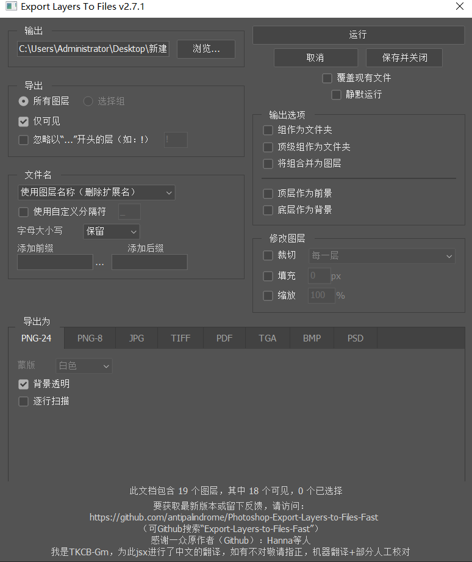

# Photoshop-Export-Layers-to-Files-Fast

此脚本允许您将 Photoshop 文档中的图层导出为独立文件，其速度远超 Adob​​e 内置脚本。

此脚本并非试图实现与内置脚本相同的功能，而是提供更精简/更高效的体验。话虽如此，欢迎随时[提出功能请求](https://github.com/antipalindrome/Photoshop-Export-Layers-to-Files-Fast/issues/new)，并随时为其做出贡献，使其更加强大！

## 目录

- [如何使用](#how-to-use)
- [示例截图](#example-screenshot)
- [功能](#features)
- [额外字段文档](#extra-field-documentation)
- [批处理/操作](#batch-processing--actions)
- [要求](#requirements)
- [贡献](#contributing)
- [反馈/错误](#feedback--bugs)

## 如何使用

_免责声明：_我们与 Adob​​e 没有任何关联。如有任何与 Adob​​e 产品或 Adob​​e 脚本相关的问题，请直接联系 Adob​​e。我们从未遇到过问题，但**请自行承担使用此脚本的风险**。我们对任何数据丢失或 PSD 损坏概不负责，因此请务必备份。

- 前往 [发布页面](https://github.com/antipalindrome/Photoshop-Export-Layers-to-Files-Fast/releases) 并下载 [最新版本](https://github.com/antipalindrome/Photoshop-Export-Layers-to-Files-Fast/releases/latest)。
- 在 Photoshop 中，前往“文件 -> 脚本 -> 浏览...”，然后选择“将图层导出到文件 (Fast).jsx”文件。
- 注意：该脚本还需要“将图层导出到文件 (Fast)-progress_bar.json”文件才能运行。如果没有该文件，您将收到“进度条资源损坏”错误。请确保“.jsx”和“.json”文件位于同一目录中。
- 您可以通过将所有脚本文件添加到“Photoshop > 预设 > 脚本”路径，将脚本添加到“脚本”菜单。
- Windows：/Program Files/Adobe/Adobe Photoshop VERSION/Presets/Scripts
- Mac：/Applications/Adobe Photoshop VERSION/Presets/Scripts

## 示例截图

## 功能

该脚本的部分功能包括……

- 支持的导出格式：
- PNG（8 位和 24 位）
- JPEG
- TIFF
- PDF
- Targa
- BMP
- PSD
- 处理分组图层中的嵌套
- 导出所有图层或仅导出可见图层
- 文件可以使用图层名称、图层 + 组名称或自动图层索引命名
- 最低图层可视为通用背景
- 导出的图像可以具有图层大小或画布大小（修剪选项）
- 上次使用的对话框设置是已记住
- 可以照常导出选定的组（逐层导出），同时保留其他所有内容。（这样可以为复杂的固定背景和前景导出可变内容。）
- 可以将组导出为文件夹层次结构；冲突的文件夹将被重命名

## 附加字段文档

### 选定的组

仅导出选定的组。请注意，您必须在启动脚本之前选择该组，否则此选项将被禁用。以这种方式运行脚本时，所有其他图层将保持不变，这意味着导出结果中可能会显示顶部或底部可见的图层。

### 忽略以字母开头的图层

选择此选项后，您可以指定用于匹配图层名称的前缀。导出过程中将忽略任何匹配的图层。

例如，如果您在输入中指定“x”，则所有以字母“x”开头的图层都不会导出。

### 文件名

| 选项 | 示例 |
| ---------------------------------- | ---------------------------------------------------------------------- |
| `使用图层名称（去除扩展名）` | `layer-3.png` => `layer-3.png` |
| `使用图层名称（保留扩展名）` | `layer-3.png` => `layer-3.png.png` |
| `使用图层和父组名称` | `group 1 > layer-3` => `group-1-layer-3.png` |
| `使用索引降序` | `layer-10`，其中 `layer-10` 是最顶层 => `01` |
| `使用索引升序` | `layer-5`，其中 `layer-5` 是最顶层 => `5` |

### 使用自定义分隔符

`使用自定义分隔符` 将启用自定义分隔符。自定义分隔符将用于代替图层名称和前缀/后缀字段中的空格。请注意，Photoshop 不支持在文件名中使用空格，因此，如果未指定自定义分隔符，则默认使用 `-` 分隔符。

例如：
`my layer 1` 将导出为 `my-layer-1`

分隔符字段**不**支持以下字符：
`\`、`/`、`*`、`?`、`|`、`.`、`:`、`"`、`<`、`>`、`%`、`,`、`;`、`=`

### 前缀/后缀

`Prefix` 和 `Suffix` 将分别为每个导出的文件名添加前缀和后缀，并且与上面“文件名”中的所有选项兼容。

以下字符**不**支持# Photoshop-Export-Layers-to-Files-Fast

此脚本允许您将 Photoshop 文档中的图层导出为独立文件，其速度远超 Adob​​e 内置脚本。

此脚本并非试图实现与内置脚本相同的功能，而是提供更精简/更高效的体验。话虽如此，欢迎随时[提出功能请求](https://github.com/antipalindrome/Photoshop-Export-Layers-to-Files-Fast/issues/new)，并随时为其做出贡献，使其更加强大！

## 目录

- [如何使用](#how-to-use)
- [示例截图](#example-screenshot)
- [功能](#features)
- [额外字段文档](#extra-field-documentation)
- [批处理/操作](#batch-processing--actions)
- [要求](#requirements)
- [贡献](#contributing)
- [反馈/错误](#feedback--bugs)

## 如何使用

_免责声明：_我们与 Adob​​e 没有任何关联。如有任何与 Adob​​e 产品或 Adob​​e 脚本相关的问题，请直接联系 Adob​​e。我们从未遇到过问题，但**请自行承担使用此脚本的风险**。我们对任何数据丢失或 PSD 损坏概不负责，因此请务必备份。

- 前往 [发布页面](https://github.com/antipalindrome/Photoshop-Export-Layers-to-Files-Fast/releases) 并下载 [最新版本](https://github.com/antipalindrome/Photoshop-Export-Layers-to-Files-Fast/releases/latest)。
- 在 Photoshop 中，前往“文件 -> 脚本 -> 浏览...”，然后选择“将图层导出到文件 (Fast).jsx”文件。
- 注意：该脚本还需要“将图层导出到文件 (Fast)-progress_bar.json”文件才能运行。如果没有该文件，您将收到“进度条资源损坏”错误。请确保“.jsx”和“.json”文件位于同一目录中。
- 您可以通过将所有脚本文件添加到“Photoshop > 预设 > 脚本”路径，将脚本添加到“脚本”菜单。
- Windows：/Program Files/Adobe/Adobe Photoshop VERSION/Presets/Scripts
- Mac：/Applications/Adobe Photoshop VERSION/Presets/Scripts

## 示例截图

## 功能

该脚本的部分功能包括……

- 支持的导出格式：
- PNG（8 位和 24 位）
- JPEG
- TIFF
- PDF
- Targa
- BMP
- PSD
- 处理分组图层中的嵌套
- 导出所有图层或仅导出可见图层
- 文件可以使用图层名称、图层 + 组名称或自动图层索引命名
- 最低图层可视为通用背景
- 导出的图像可以具有图层大小或画布大小（修剪选项）
- 上次使用的对话框设置是已记住
- 可以照常导出选定的组（逐层导出），同时保留其他所有内容。（这样可以为复杂的固定背景和前景导出可变内容。）
- 可以将组导出为文件夹层次结构；冲突的文件夹将被重命名

## 附加字段文档

### 选定的组

仅导出选定的组。请注意，您必须在启动脚本之前选择该组，否则此选项将被禁用。以这种方式运行脚本时，所有其他图层将保持不变，这意味着导出结果中可能会显示顶部或底部可见的图层。

### 忽略以字母开头的图层

选择此选项后，您可以指定用于匹配图层名称的前缀。导出过程中将忽略任何匹配的图层。

例如，如果您在输入中指定“x”，则所有以字母“x”开头的图层都不会导出。

### 文件名

| 选项 | 示例 |
| ---------------------------------- | ---------------------------------------------------------------------- |
| `使用图层名称（去除扩展名）` | `layer-3.png` => `layer-3.png` |
| `使用图层名称（保留扩展名）` | `layer-3.png` => `layer-3.png.png` |
| `使用图层和父组名称` | `group 1 > layer-3` => `group-1-layer-3.png` |
| `使用索引降序` | `layer-10`，其中 `layer-10` 是最顶层 => `01` |
| `使用索引升序` | `layer-5`，其中 `layer-5` 是最顶层 => `5` |

### 使用自定义分隔符

`使用自定义分隔符` 将启用自定义分隔符。自定义分隔符将用于代替图层名称和前缀/后缀字段中的空格。请注意，Photoshop 不支持在文件名中使用空格，因此，如果未指定自定义分隔符，则默认使用 `-` 分隔符。

例如：
`my layer 1` 将导出为 `my-layer-1`

分隔符字段**不**支持以下字符：
`\`、`/`、`*`、`?`、`|`、`.`、`:`、`"`、`<`、`>`、`%`、`,`、`;`、`=`

### 前缀/后缀

`Prefix` 和 `Suffix` 将分别为每个导出的文件名添加前缀和后缀，并且与上面“文件名”中的所有选项兼容。

以下字符**不**支持
